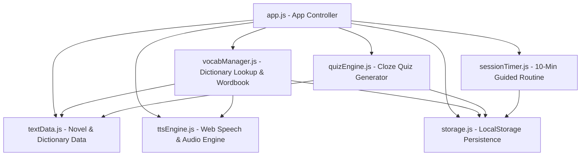
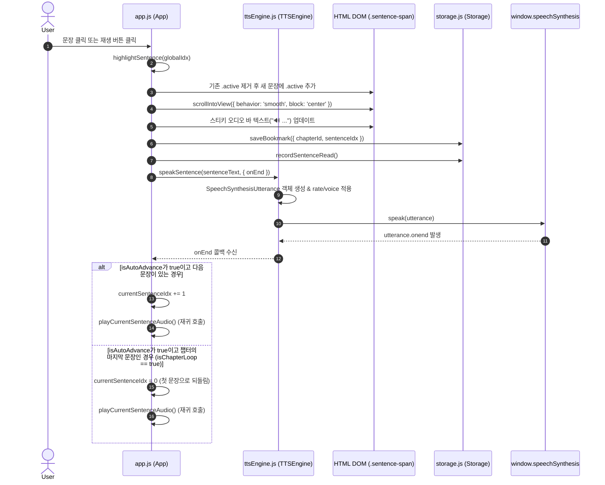
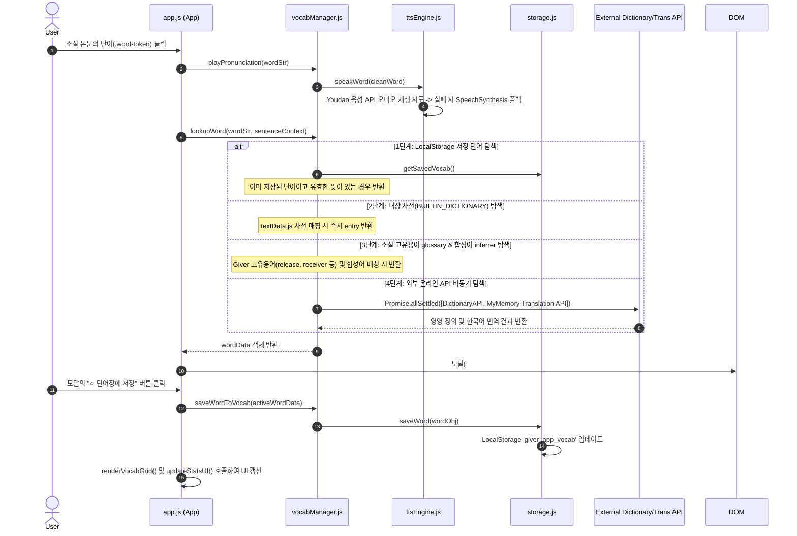
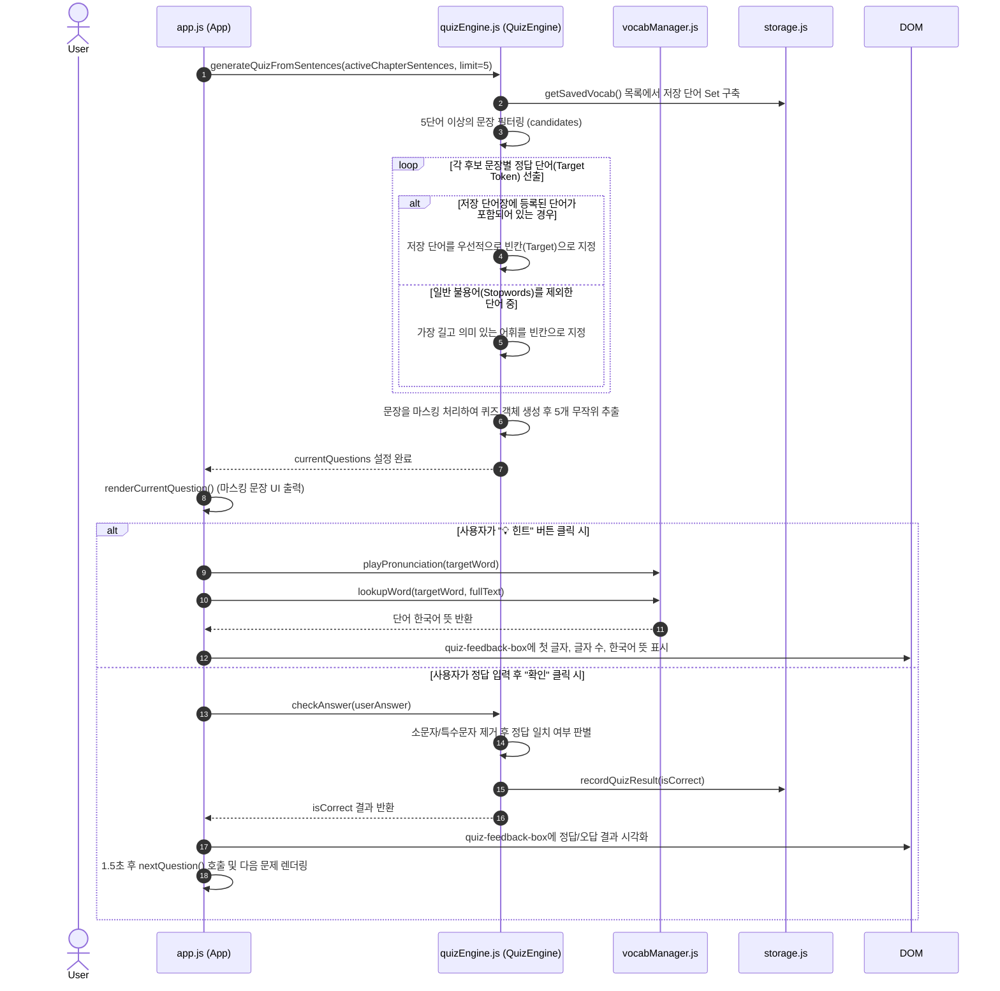

# The Giver Learner - 시스템 아키텍처 및 핵심 데이터 흐름 문서 (ARCHITECTURE.md)

본 문서는 *The Giver - 소설 기반 10분 일일 영어 학습* 웹 애플리케이션의 모듈 구조, 이벤트 흐름, 상태 관리 및 데이터 스키마를 명확히 정의합니다.

---

## 1. 시스템 아키텍처 개요 (System Overview)

본 앱은 프레임워크 의존성이 없는 **Vanilla JavaScript (ES6+ Module)** 기반의 SPA(Single Page Application) 구조로 설계되었습니다.



### 파일 및 모듈별 역할 정의

| 파일 경로 | 주요 역할 |
|---|---|
| [`index.html`](file:///d:/%EB%B0%94%EC%9D%B4%EB%B8%8C/07_Giver_%EC%98%81%EC%96%B4%ED%95%99%EC%8A%B5/index.html) | 메인 DOM 구조, 뷰 탭, 모달 및 스티키 오디오 컨트롤바 |
| [`css/main.css`](file:///d:/%EB%B0%94%EC%9D%B4%EB%B8%8C/07_Giver_%EC%98%81%EC%96%B4%ED%95%99%EC%8A%B5/css/main.css) | 글로벌 스타일 래퍼, Dark Glassmorphism 테마 토큰 정의 |
| [`css/components.css`](file:///d:/%EB%B0%94%EC%9D%B4%EB%B8%8C/07_Giver_%EC%98%81%EC%96%B4%ED%95%99%EC%8A%B5/css/components.css) | 플로팅 플레이어, 퀴즈 카포너트, 플래시카드, 셀렉터 스타일 |
| [`js/app.js`](file:///d:/%EB%B0%94%EC%9D%B4%EB%B8%8C/07_Giver_%EC%98%81%EC%96%B4%ED%95%99%EC%8A%B5/js/app.js) | 메인 애플리케이션 진입점 컨트롤러 (`App` 클래스) |
| [`js/textData.js`](file:///d:/%EB%B0%94%EC%9D%B4%EB%B8%8C/07_Giver_%EC%98%81%EC%96%B4%ED%95%99%EC%8A%B5/js/textData.js) | *The Giver* (Ch 1~5) 원문 단락, 문장 토큰 파서, 내장 어휘 사전 데이터 |
| [`js/ttsEngine.js`](file:///d:/%EB%B0%94%EC%9D%B4%EB%B8%8C/07_Giver_%EC%98%81%EC%96%B4%ED%95%99%EC%8A%B5/js/ttsEngine.js) | Web Speech API 및 외장 오디오 링커 기반 TTS 음성 재생 엔진 |
| [`js/vocabManager.js`](file:///d:/%EB%B0%94%EC%9D%B4%EB%B8%8C/07_Giver_%EC%98%81%EC%96%B4%ED%95%99%EC%8A%B5/js/vocabManager.js) | 다단계 사전 검색(내장/고유용어/외부 API) 및 단어장 저장 매니저 |
| [`js/quizEngine.js`](file:///d:/%EB%B0%94%EC%9D%B4%EB%B8%8C/07_Giver_%EC%98%81%EC%96%B4%ED%95%99%EC%8A%B5/js/quizEngine.js) | 문장 기반 빈칸 생성, 가중치 어휘 추출 및 채점 엔진 |
| [`js/sessionTimer.js`](file:///d:/%EB%B0%94%EC%9D%B4%EB%B8%8C/07_Giver_%EC%98%81%EC%96%B4%ED%95%99%EC%8A%B5/js/sessionTimer.js) | 10분 가이드 학습 루틴 카운트다운 타이머 및 단계 변경 관리자 |
| [`js/storage.js`](file:///d:/%EB%B0%94%EC%9D%B4%EB%B8%8C/07_Giver_%EC%98%81%EC%96%B4%ED%95%99%EC%8A%B5/js/storage.js) | LocalStorage 영속화 데이터 핸들러 및 JSON 백업 내보내기/불러오기 |

---

## 2. 상세 로직 및 데이터 흐름 분석

### (1) TTS 재생 및 문장 하이라이트 로직 (TTS Playback & Highlighting)



#### 주요 핵심 메서드
- **`App.prototype.highlightSentence(globalIdx)`**:
  1. `document.querySelectorAll('.sentence-span')`에서 모든 `.active` 클래스 제거.
  2. `[data-global-idx="${globalIdx}"]` 요소를 탐색하여 `.active` 클래스 부여 및 `scrollIntoView()` 실행.
  3. 위치 정보(`current-pos-text`) 및 스티키 상단 미리보기(`playing-sentence-text`) 업데이트.
  4. `storage.saveBookmark()` 및 `storage.recordSentenceRead()` 호출하여 읽은 진도 저장.
- **`TTSEngine.prototype.speakSentence(text, options)`**:
  1. `window.speechSynthesis.cancel()` 역할을 수행하는 `this.stop()` 실행.
  2. `SpeechSynthesisUtterance` 인스턴스를 생성하고 선호 언어(US/UK English) 및 배속(`this.rate`) 적용.
  3. `onstart`, `onend`, `onerror` 핸들러 바인딩 후 `speechSynthesis.speak()`로 발화 시작.

---

### (2) 단어 클릭 → 사전 조회 → 단어장 저장 흐름 (Word Click & Vocab Flow)



#### 다단계 사전 검색 우선순위 체계 (`lookupWord`)
1. **저장 단어 우선 검사**: LocalStorage `giver_app_vocab`에 유효한 뜻이 수집되어 있다면 기존 데이터를 재사용.
2. **내장 사전 검사 (`BUILTIN_DICTIONARY`)**: `textData.js`에 수록된 1~5장 주요 어휘 40여 개 매칭.
3. **고유 용어 및 합성어 추론 (`inferCompoundWordOrNovelTerm`)**: *The Giver* 세계관 단어(Release, Stirrings, Nurturer 등) 및 합성어(Riverbank, Aircraft 등) 추론.
4. **온라인 API 폴백 (Fallbacks)**:
   - **영영 정의/발음**: `https://api.dictionaryapi.dev/api/v2/entries/en/{word}`
   - **한글 뜻 번역**: `https://api.mymemory.translated.net/get?q={word}&langpair=en|ko`

---

### (3) 퀴즈 생성 및 채점/힌트 로직 (Cloze Quiz Generation & Evaluation)



#### 퀴즈 문제 객체 구조 (`Question Object`)
```typescript
interface QuizQuestion {
  id: string;             // 예: 'q-0'
  sentenceId: string;     // 예: 'c1-p1-s0'
  fullText: string;       // 원문 전체 문장
  targetWord: string;     // 원래 단어 (예: 'frightened')
  targetClean: string;    // 정규화된 단어 (예: 'frightened')
  tokens: Array<{
    type: 'word' | 'punct';
    text: string;
    clean?: string;
    isTarget?: boolean;   // 빈칸 대상 여부
  }>;
  firstLetter: string;    // 첫 글자 대문자 (힌트용)
  wordLength: number;     // 단어 길이 (힌트용)
}
```

---

## 3. LocalStorage 키 및 데이터 백업 스키마 (Storage & Backup Schema)

### LocalStorage 키 이름 정의

| 키 이름 (Key) | 상수명 (`STORAGE_KEYS`) | 저장 형태 | 주요 용도 |
|---|---|---|---|
| `giver_app_bookmark` | `BOOKMARK` | JSON String | 현재 읽고 있는 챕터 ID 및 문장 위치 저장 |
| `giver_app_vocab` | `VOCABULARY` | JSON Array | 사용자가 수집한 단어장 카드 목록 저장 |
| `giver_app_stats` | `STATS` | JSON Object | 누적 학습 시간, 읽은 문장 수, 퀴즈 성적, 연수 학습 일수 |
| `giver_app_custom_novels` | `CUSTOM_NOVELS` | JSON Array | (확장용) 사용자 커스텀 소설 데이터 |

---

### 데이터 백업 JSON 스키마 (`exportBackupJSON` / `importBackupJSON`)

`storage.exportBackupJSON()` 실행 시 다운로드되는 `.json` 파일의 정확한 데이터 구조 스키마입니다.

```json
{
  "$schema": "http://json-schema.org/draft-07/schema#",
  "title": "GiverAppBackupData",
  "type": "object",
  "required": ["version", "exportedAt", "bookmark", "vocabulary", "stats"],
  "properties": {
    "version": {
      "type": "integer",
      "example": 1
    },
    "exportedAt": {
      "type": "string",
      "format": "date-time",
      "example": "2026-08-11T15:00:00.000Z"
    },
    "bookmark": {
      "type": "object",
      "required": ["chapterId", "sentenceIdx"],
      "properties": {
        "chapterId": { "type": "string", "example": "giver-ch1" },
        "sentenceIdx": { "type": "integer", "example": 3 },
        "paragraphIdx": { "type": "integer", "example": 0 }
      }
    },
    "vocabulary": {
      "type": "array",
      "items": {
        "type": "object",
        "required": ["word", "meaning", "status", "addedAt"],
        "properties": {
          "word": { "type": "string", "example": "apprehensive" },
          "phonetics": { "type": "string", "example": "/ˌæprɪˈhensɪv/" },
          "meaning": { "type": "string", "example": "걱정되는, 불안한" },
          "definition": { "type": "string", "example": "Anxious or fearful that something bad will happen." },
          "example": { "type": "string", "example": "Jonas was eager, yes, but he was also apprehensive." },
          "status": { "type": "string", "enum": ["new", "review", "mastered"], "example": "review" },
          "addedAt": { "type": "integer", "example": 1786444800000 },
          "updatedAt": { "type": "integer", "example": 1786444800000 }
        }
      }
    },
    "stats": {
      "type": "object",
      "required": ["totalStudySeconds", "sentencesReadCount", "quizAttemptCount", "quizCorrectCount", "streakDays", "lastStudyDate", "dailyHistory"],
      "properties": {
        "totalStudySeconds": { "type": "integer", "example": 1200 },
        "sentencesReadCount": { "type": "integer", "example": 45 },
        "quizAttemptCount": { "type": "integer", "example": 10 },
        "quizCorrectCount": { "type": "integer", "example": 8 },
        "streakDays": { "type": "integer", "example": 3 },
        "lastStudyDate": { "type": "string", "format": "date", "example": "2026-08-11" },
        "dailyHistory": {
          "type": "object",
          "additionalProperties": {
            "type": "object",
            "properties": {
              "seconds": { "type": "integer", "example": 600 },
              "sentences": { "type": "integer", "example": 20 },
              "quizCorrect": { "type": "integer", "example": 4 }
            }
          }
        }
      }
    }
  }
}
```

---

## 4. 모듈 간 이벤트 및 데이터 바인딩 요약

1. **글로벌 챕터 동기화**: `App.prototype.switchChapter(chapterId)`가 호출되면 `#header-chapter-select`, `#reader-chapter-select` 드롭다운과 소설 리더 뷰, 10분 가이드 루틴 뱃지, 퀴즈 뱃지가 한 번에 업데이트됩니다.
2. **모바일/반응형 호환성**: Web Speech API와 HTML5 Audio Element 폴백을 동시 지원하여 iOS Safari, Android Chrome 및 데스크톱 브라우저 전반에서 안정적인 TTS 재생을 보장합니다.
