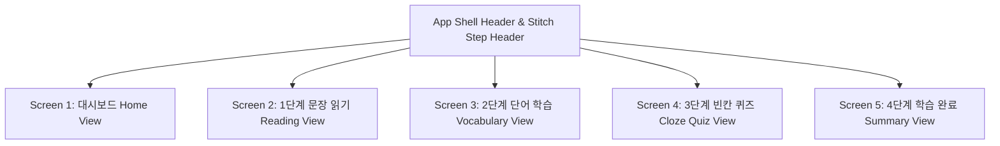

# Daily 10-Min English - Google Stitch Rose Design System (DESIGN.md)

본 문서는 최신 **Google Stitch 5개 화면 디자인 보드 (Pink / Rose / Magenta 테마)** 사양에 따른 시스템 토큰, 컴포넌트 구조 및 5개 뷰 체계를 정의합니다.

---

## 1. 디자인 시스템 토큰 명세 (Design Tokens)

### 🎨 컬러 팔레트 (Color Palette)

#### Google Stitch Rose / Magenta 메인 테마
| 변수명 | Hex / Value | 사용 용도 |
|---|---|---|
| `--stitch-rose` | `#9f1239` (Rose 800) | Stitch 시그니처 프라이머리 색상, 활성 카드 테두리 |
| `--stitch-rose-dark` | `#881337` (Rose 900) | 프라이머리 알약 버튼 (`Next Step ->`, `Start Today's Session ->`) |
| `--stitch-rose-light` | `#fff1f2` (Rose 50) | 예문 상자, 카드 틴트 배경, 퀴즈 폼 박스 |
| `--stitch-bg` | `#faf5f7` | Stitch 최하단 소프트 크림-핑크 배경 |
| `--stitch-card-bg` | `#ffffff` | 플래시카드 및 컨테이너 표면 |
| `--stitch-card-border` | `#fecdd3` (Rose 200) | 카드 및 인풋 테두리 |
| `--stitch-pill-hl` | `#fbcfe8` (Pink 200) | 예문 내 키워드 하이라이팅 뱃지 배경 |
| `--stitch-pill-hl-text` | `#9d174d` (Pink 800) | 예문 내 키워드 하이라이팅 텍스트 |
| `--accent-emerald-bg` | `#dcfce7` | ⚡ `15 Days Streak` 스트릭 에메랄드 뱃지 배경 |
| `--accent-emerald-text`| `#15803d` | ⚡ 스트릭 뱃지 텍스트 |

---

## 2. 5개 화면별 스티치 뷰 체계 (5 Screens Layout)

### Screen 1: 대시보드 (Home View - `#session-view`)
- `Daily 10` 메인 타이틀
- `⚡ 15 Days Streak` 에메랄드 스트릭 뱃지
- `Today's Goal` 원형 진행 차트 (`4 / 10` mins)
- `Start Today's Session ->` 딥 로즈 알약 버튼
- `342 Words Learned` + `5h 20m Total Reading` 요약 카드

### Screen 2: 1단계 문장 읽기 (Reading View - `#reader-view`)
- `🟢 Read along to improve pronunciation and pacing.` 에메랄드 가이드 뱃지
- 스티키 오디오 플레이어 바 (`1.0x` 속도, 오디오 토글, `Next Step ->` 버튼)

### Screen 3: 2단계 단어 학습 (Vocabulary View - `#vocab-view`)
- `Step 2: Vocabulary (3 mins remaining)` 스텝 헤더 + `2/4` 원형 뱃지
- 핑크 틴트 예문상자 + 보라/핑크 키워드 뱃지 + 한/영 번역 문장

### Screen 4: 3단계 빈칸 퀴즈 (Cloze Quiz View - `#quiz-view`)
- `FILL IN THE BLANK` + 🔊 음성 버튼
- 핑크 테두리 `[Type here]` 입력창 + `💡 Hint` 버튼

### Screen 5: 4단계 학습 완료 (Summary View - `#stats-view`)
- `Step 4: Summary (1 min)` 헤더
- 🏆 트로피 카드 + `10 mins studied` / `12 words learned` 요약
- `Quiz Accuracy 100%` 녹색 체크카드
- `☁️ Data Saved Securely` + `📁 JSON Export` + `☁️ Cloud Backup`
- `Finish Session ->` 딥 로즈 알약 버튼
