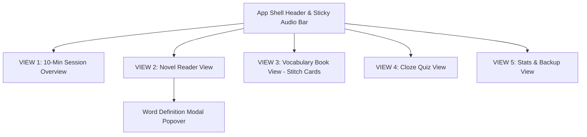

# Daily 10-Min English - Google Stitch UI 디자인 가이드 문서 (DESIGN.md)

본 문서는 *Daily 10-Min English (The Giver Learner)* 애플리케이션에 적용된 **Google Stitch UI 디자인 시스템**, 토큰 명세, 컴포넌트 라이브러리 및 화면별 UI 구조를 상세히 정의합니다.

---

## 1. 디자인 시스템 토큰 명세 (Design Tokens)

### 🎨 컬러 팔레트 (Color Palette)

#### Google Stitch 메인 테마 & 배경 (Backgrounds)
| 변수명 | Hex / Value | 사용 용도 |
|---|---|---|
| `--stitch-indigo` | `#4f46e5` (Indigo 600) | Stitch 시그니처 프라이머리 색상, 활성 카드 테두리 |
| `--stitch-indigo-dark` | `#4338ca` (Indigo 700) | 프라이머리 알약 버튼 호버/그라데이션 |
| `--stitch-indigo-light` | `#e0e7ff` (Indigo 100) | 예문 테두리, 연푸른 틴트 배경 |
| `--stitch-bg` | `#f8fafc` (Slate 50) | Stitch 뷰 컨테이너 및 탭 리빌 바 배경 |
| `--stitch-card-bg` | `#ffffff` (White) | 플래시카드 표면 배경 |
| `--stitch-card-border` | `#e2e8f0` (Slate 200) | 미선택 플래시카드 은은한 테두리 |
| `--stitch-text` | `#0f172a` (Slate 900) | 카드 메인 단어, 표제어, 메인 뜻 |
| `--stitch-subtext` | `#64748b` (Slate 500) | 발음기호, 영문 단어 서브타이틀, 약식 안내 |
| `--stitch-pill-hl` | `#c7d2fe` (Indigo 200) | 예문 내 키워드 하이라이팅 뱃지 배경 |
| `--stitch-pill-hl-text` | `#3730a3` (Indigo 800) | 예문 내 키워드 하이라이팅 텍스트 |
| `--stitch-gold` | `#f59e0b` (Amber 500) | 즐겨찾기 별(Star) 아이콘 활성 색상 |

---

### 🔤 타이포그래피 스케일 (Typography Scale)

#### 글꼴 폰트 패밀리 (Font Family)
- **헤더 & 타이틀**: `'Outfit', sans-serif` (Google Fonts, Wght 400~800)
- **본문 & UI 텍스트**: `'Inter', sans-serif` (Google Fonts, Wght 300~700)

#### 글자 크기 및 두께 (Type Scale)

| 레벨 | 폰트 패밀리 | Size | Weight | Line Height | 주요 적용 대상 |
|---|---|---|---|---|---|
| **Display Level** | Outfit | 2.2rem (35px) | 800 (Bold) | 1.1 | 10분 타이머 카운트다운 (`.timer-countdown`) |
| **Card Word Title** | Outfit | 1.7rem (27.2px) | 700 (Bold) | 1.25 | 플래시카드 앞면 단어 표제어 (`.card-front h3`) |
| **Card Meaning** | Outfit | 1.35rem (21.6px) | 800 (Bold) | 1.3 | 플래시카드 뒷면 한국어 메인 뜻 (`.card-back h3`) |
| **Title 1 (H1)** | Outfit | 1.75rem (28px) | 700 (Bold) | 1.3 | 소설 리더 뷰 챕터 제목 (`.novel-title`) |
| **Title 2 (H2)** | Outfit | 1.6rem (25.6px) | 700 (Bold) | 1.35 | 탭별 메인 뷰 섹션 제목 (`h2`) |
| **Body Large** | Inter | 1.15rem (18.4px) | 400 (Regular) | 1.9 | 소설 원문 본문 단락 (`.paragraph-block`) |
| **POS Badge** | Inter | 0.72rem (11.5px) | 700 (Bold) | 1.0 | 품사 약식 뱃지 (`.pos-badge` - NOUN, VERB) |
| **Tap Reveal Bar** | Inter | 0.82rem (13.1px) | 600 (SemiBold)| 1.2 | 카드 하단 뒤집기 안내 바 (`.tap-reveal-bar`) |

---

### 📐 간격 & 모서리 반경 (Spacing & Radius)

| 변수명 | 값 | 적용 컴포넌트 |
|---|---|---|
| `--radius-sm` | `8px` | 문장 하이라이트 span, 소형 발음 버튼, POS 뱃지 |
| `--radius-md` | `12px` | 예문 상자 (`.stitch-example-box`), 챕터 선택 셀렉트박스 |
| `--radius-lg` | `20px` | Stitch 플래시카드, 타이머 배너, 리더 컨테이너, 퀴즈 카드 |
| `--radius-full`| `9999px` | `Next Step ->` 프라이머리 알약 버튼, 원형 단계 뱃지 (`.stitch-step-circle`) |

---

### 🌑 그림자 & 글로우 체계 (Elevation)

| Elevation | Shadow CSS Value | 주요 적용 대상 |
|---|---|---|
| **Stitch Card Soft** | `0 4px 14px rgba(15, 23, 42, 0.06)` | 미선택 Stitch 플래시카드 기본 상태 |
| **Stitch Card Active** | `0 8px 24px rgba(79, 70, 229, 0.15)` | 활성화된/뒤집힌 Stitch 플래시카드 (Indigo Border) |
| **Next Step Pill** | `0 8px 20px rgba(79, 70, 229, 0.3)` | `Next Step ->` 고정 프라이머리 버튼 |

---

## 2. 화면별 컴포넌트 구조 (Screen Component Tree)

### 1. Google Stitch 10분 가이드 타이머 배너 (`.timer-banner`)
- **Step Circle Badge (`.stitch-step-circle`)**: 원형 뱃지 (예: `1/4`, `2/4`, `3/4`)
- **Step Header Info**: 단계 명칭 & 카운트다운 타이머 디스플레이
- **Next Step Button (`.next-step-btn`)**: 알약 형태의 단계 이동 버튼 (`Next Step ->`)

---

### 2. Google Stitch 플래시카드 컴포넌트 (`.flashcard`)

#### 카드 앞면 (`.card-front`)
1. **상단 컨트롤**: 좌측 품사 약식 뱃지 (`.pos-badge` - `NOUN`, `VERB`, `ADJ`) + 우측 즐겨찾기 별 버튼 (`.star-btn.is-active` - `★` / `☆`)
2. **중앙 표제어**: 영어 단어명 (`h3`) + 슬래시 표기 발음기호 (`.word-phonetic`)
3. **하단 뒤집기 안내 바 (`.tap-reveal-bar`)**: `👆 Tap to reveal meaning` (Soft Blue Background)

#### 카드 뒷면 (`.card-back`)
1. **상단 컨트롤**: 좌측 품사 약식 뱃지 (`.pos-badge`) + 우측 즐겨찾기 별 버튼 (`.star-btn`)
2. **중앙 의미 영역**:
   - 굵은 한국어 메인 뜻 (`h3` - 예: **회복력, 탄성**)
   - 영어 단어 서브타이틀 (`p` - 예: Resilience)
   - **Stitch 예문 상자 (`.stitch-example-box`)**:
     - 연푸른 배경 상자 (`background: #eff6ff`)
     - 키워드 하이라이팅 뱃지 (`.word-hl-badge` - 예: resilience)
3. **하단 뒤집기 안내 바**: `📑 Tap to flip back`

---

### 3. 나만의 단어장 뷰 (`#vocab-view`)
- **Filter Bar**: `전체`, `복습 필요`, `암기 완료` 필터 버튼 그룹
- **Vocab Card Grid (`.vocab-grid`)**: Stitch 플래시카드 그리드 렌더링
  - 클릭/터치 시 3D 카드 뒤집기 애니메이션 수행 및 원어민 음성(TTS) 자동 재생
  - 별표 클릭 시 즐겨찾기 상태 변경 (`status = 'mastered'`) 및 굵은 Indigo 테두리 활성화

---

### 🌐 배포 확인 링크
- **GitHub**: [https://github.com/leesuna/07_Giver_Eng.git](https://github.com/leesuna/07_Giver_Eng.git)
- **Vercel**: [https://giver-english-novel-app.vercel.app](https://giver-english-novel-app.vercel.app)
