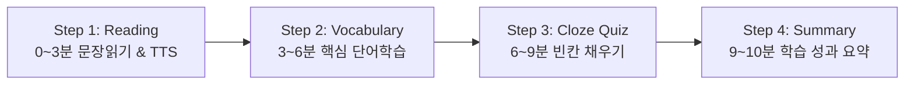

# 📖 The Giver Learner - 10분 일일 영어 학습 사용자 가이드 (USER_GUIDE.md)

본 문서는 **The Giver Learner (소설 기반 10분 맞춤 영어 학습 애플리케이션)**의 기능 설명, 단계별 사용 방법, 주요 UI 컨트롤 및 학습 팁을 안내하는 공식 사용 설명서입니다.

---

## 🌟 1. 앱 소개 (Overview)

**The Giver Learner**는 세계적인 명작 영문 소설 *The Giver* (Lois Lowry 저) 원문을 활용하여 매일 부담 없이 **10분간 4단계 학습 코스**를 이수할 수 있도록 설계된 웹 기반 영어 학습 애플리케이션입니다.

- **서비스 라이브 주소**: [https://giver-english-novel-app.vercel.app](https://giver-english-novel-app.vercel.app)
- **주요 특징**:
  - 하루 10분 타이머로 구성된 몰입형 4단계 학습 루틴
  - 원문 문장 클릭 시 자연스러운 TTS 음성 재생 및 팝업 단어 검색
  - 양방향 플래시카드 단어장 및 퀴즈 엔진 제공
  - 반응형 디자인으로 PC, 모바일, 태블릿 어디서나 편리하게 이용

---

## 🎯 2. 10분 맞춤 학습 코스 구성 (4 Steps Routine)

메인 화면의 **`▶ 10분 학습 시작`** 또는 **`Start Today's Session ->`** 버튼을 누르면 아래 4단계 루틴이 자동으로 진행됩니다.

### 1단계: 문장 읽기 & TTS 오디오 (Step 1: Reading / 3분)
- 소설 본문을 차례대로 읽으며 TTS 원문 음성을 청취합니다.
- 본문 속 **모든 영단어를 클릭**하면 사전 팝업 모달이 노출되어 발음 듣기, 한국어 뜻 확인 및 단어장에 즉시 추가할 수 있습니다.
- 상단 오디오 플레이어 바를 통해 재생 속도(`0.75x` ~ `1.5x`), 문장 이동, 글자 크기(`A-`/`A+`), 연속 재생을 자유롭게 컨트롤합니다.

### 2단계: 핵심 단어 학습 (Step 2: Vocabulary / 3분)
- 학습 중 단어장에 수집한 단어들이 **Google Stitch 핑크 틴트 플래시카드**로 표시됩니다.
- 카드 클릭 시 앞면(단어, 품사 뱃지, 발음)과 뒷면(한국어 메인 뜻, 문맥 예문 및 한국어 번역)이 부드럽게 뒤집힙니다.
- **`★` (별표/즐겨찾기)** 버튼을 눌러 복습할 단어를 선별 관리할 수 있습니다.

### 3단계: 문장 빈칸 퀴즈 (Step 3: Cloze Quiz / 3분)
- 읽은 소설 원문 문장에서 핵심 어휘가 괄호 `( ____ )`로 비워진 퀴즈가 출제됩니다.
- 정답 입력 후 `Check` 버튼을 눌러 정답 여부를 확인합니다.
- **`🔊` 음성 버튼**: 문장 전체를 다시 들을 수 있습니다.
- **`💡 Hint` 버튼**: 첫 글자와 단어 길이, 한국어 뜻을 **선명한 진한 갈색 텍스트**로 확인할 수 있습니다.

### 4단계: 학습 마무리 & 기록 (Step 4: Summary / 1분)
- 🏆 트로피 카드와 함께 오늘 공부한 **학습 시간**, **수집한 단어**, **퀴즈 정답률** 성과가 요약됩니다.
- **`Finish Session ->`** 버튼을 누르면 학습 데이터가 자동 저장되고 대시보드로 돌아갑니다.

---

## 🎮 3. 주요 버튼 및 인터페이스 컨트롤 사용법

| 컨트롤 위치 | 버튼 / 아이콘 | 기능 설명 |
|---|---|---|
| **상단 우측 헤더** | `▶ 10분 학습 시작` | 10분 일일 학습 루틴을 시작합니다. |
| **상단 우측 헤더** | `⏹ 10분 학습 중지` | 진행 중인 학습과 음성을 중단하고 **진행 학습 시간** 및 **누적 접속 횟수** 팝업을 표시합니다. |
| **상단 네비게이션** | `10분 루틴` ~ `학습 기록` | 5개의 메인 뷰 섹션 간을 자유롭게 전환합니다. |
| **화면 최하단 바** | `< Prev Step` / `Next Step >` | 이전/다음 학습 단계로 양방향 이동합니다. 이동 시 오디오가 자동 정지됩니다. |
| **소설 리더 상단** | 오디오 플레이어 바 | 재생/일시정지, 문장 반복, 이전/다음 문장, 정지, 글자 크기 조절, 속도 셀렉트박스를 제어합니다. |
| **단어 팝업 모달** | `⭐ 단어장에 저장` | 본문에서 클릭한 단어를 나의 단어장에 저장합니다. |

---

## 💾 4. 데이터 백업 및 복원 (Data Backup & Sync)

학습 기록과 단어장은 브라우저 내부에 안전하게 보존되며, 다른 PC나 모바일 기기로 이전할 수 있습니다.

1. **내보내기 (.json)**:
   - `학습 기록` 탭 하단의 `📁 JSON Export` 버튼을 누르면 현재 학습 기록과 단어장이 JSON 파일로 다운로드됩니다.
2. **불러오기 (.json)**:
   - `☁️ Cloud Backup` 버튼을 눌러 저장해둔 `.json` 파일을 선택하면 단어장과 진도가 즉시 복원됩니다.

---

## 📱 5. 접속 및 권장 환경

- **권장 브라우저**: Google Chrome, Microsoft Edge, Apple Safari, Naver Whale 최신 버전
- **모바일 지원**: Android 및 iOS 모바일 브라우저에 최적화된 반응형 뷰 제공
